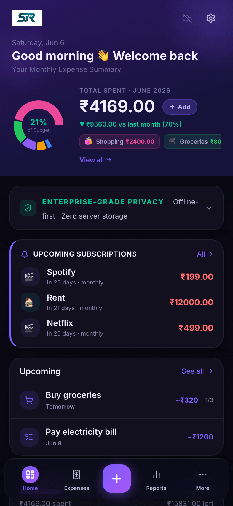
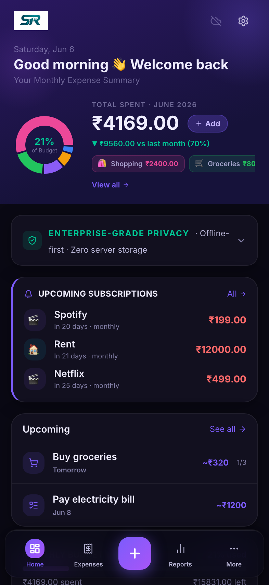
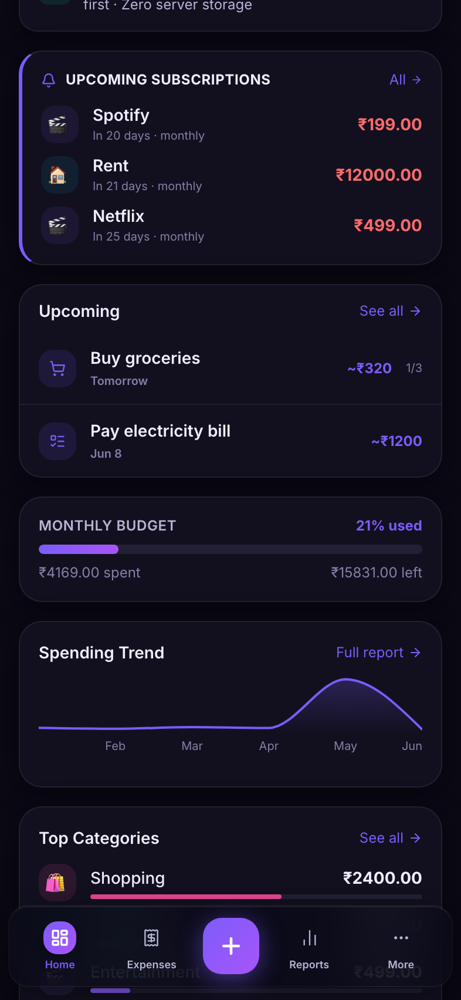
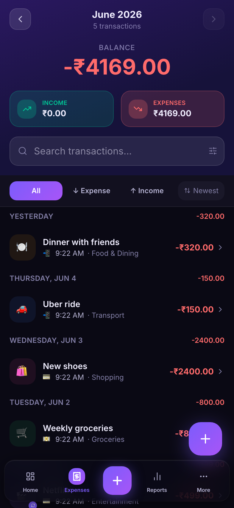
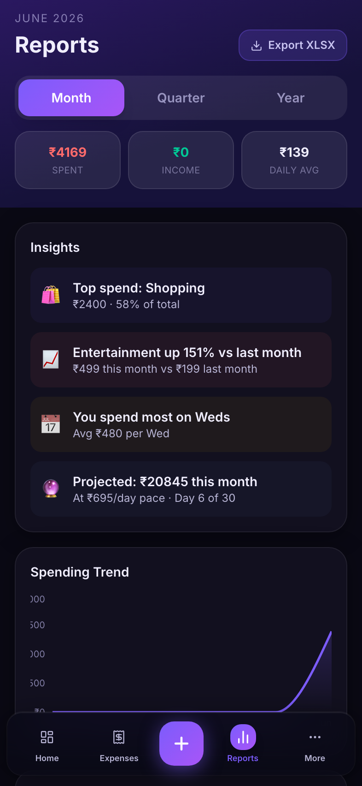
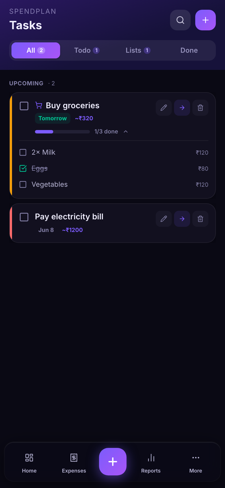
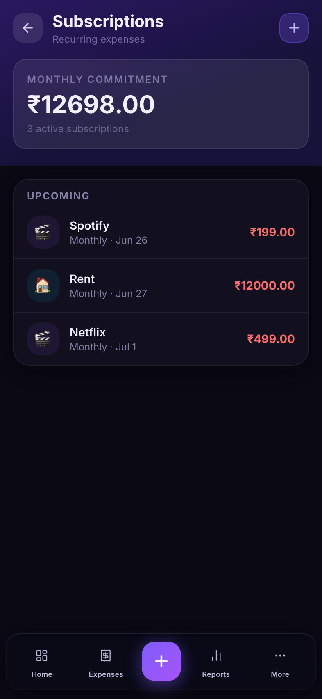
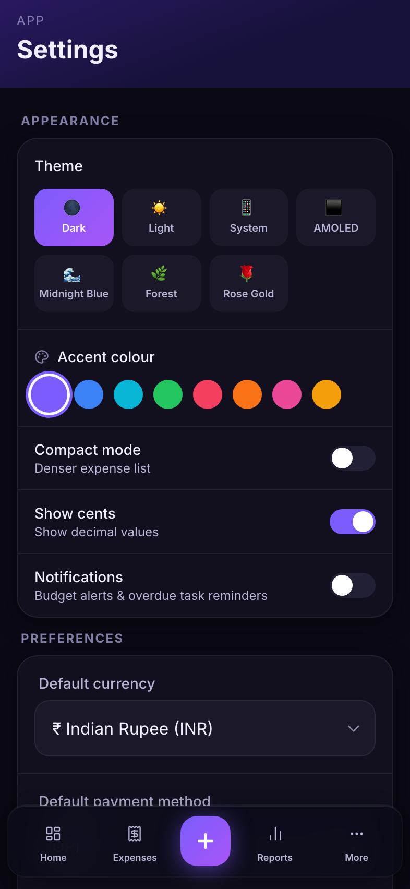
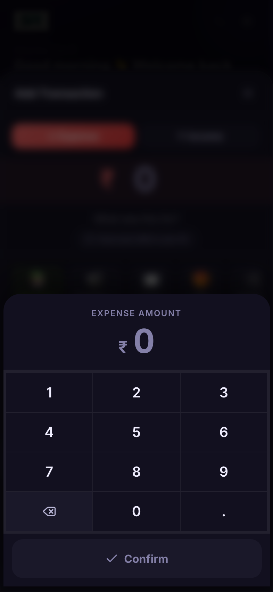

<p align="center">
  
</p>

<h1 align="center">SR Expense — SpendWise</h1>

<p align="center">
  <strong>A fully offline, zero-backend personal finance PWA.</strong><br/>
  No sign-up. No server. No data leaves your device.
</p>

<p align="center">
  <a href="https://expense-manager-in.vercel.app" target="_blank">
    
  </a>
</p>

<p align="center">
  
  
  
  
  
  
</p>

---

<p align="center">
  
</p>

---

## The idea

Most expense apps require an account. Your financial data lives on someone else's server, gets analysed, monetised, or leaked. The alternative — a local spreadsheet — has no charts, no mobile UX, and no intelligence.

SR Expense takes a third path: a **production-quality mobile app with zero backend**. All data lives in the browser's IndexedDB. Cloud backup goes to **your own Google Drive**, not mine. The server only serves static files.

<!--
---

## Screenshots

<table>
  <tr>
    <td align="center"><br/><sub><b>Dashboard</b></sub></td>
    <td align="center"><br/><sub><b>Trends & Budget</b></sub></td>
    <td align="center"><br/><sub><b>Expense List</b></sub></td>
    <td align="center"><br/><sub><b>Reports</b></sub></td>
  </tr>
  <tr>
    <td align="center"><br/><sub><b>Tasks / SpendPlan</b></sub></td>
    <td align="center"><br/><sub><b>Subscriptions</b></sub></td>
    <td align="center"><br/><sub><b>Settings (7 themes)</b></sub></td>
    <td align="center"><br/><sub><b>Quick Add (NumPad)</b></sub></td>
  </tr>
</table>
-->

---

## Architecture

```
┌──────────────────────────────────────────────────────┐
│                    Browser (PWA)                      │
│                                                       │
│  React 19 + React Router 7 (SPA, code-split routes)  │
│         │                                             │
│  Zustand stores  ──────→  Dexie.js (IndexedDB)        │
│  (in-memory state)         (persistent storage)       │
│         │                                             │
│  Optional: Google Drive API (user's own Drive)        │
│         └── appdata folder (private, not in UI)       │
│         └── drive.file scope (shared group files)     │
└──────────────────────────────────────────────────────┘
         │
         │  Vercel CDN (serves static files only)
         │  No API routes. No database. No secrets.
```

### Key design decisions

| Decision                         | Alternative considered    | Why this way                                                                                                                                       |
| -------------------------------- | ------------------------- | -------------------------------------------------------------------------------------------------------------------------------------------------- |
| **IndexedDB via Dexie**          | SQLite WASM, localStorage | Indexed queries on `date`, `categoryId`, `isRecurring` — real relational-style filtering without a server. localStorage is sync and has a 5 MB cap |
| **Zustand over Redux**           | Redux Toolkit, Jotai      | One store = one file. No boilerplate, no providers, direct selector subscriptions. Persist middleware for instant rehydration                      |
| **Google Drive `appdata` scope** | My own S3/DB, Firebase    | User's data stays in user's Drive. The app has zero access to their regular Drive. No GDPR surface. No data retention liability                    |
| **PWA over React Native**        | Expo, Capacitor           | Single codebase, zero app store friction, installable on iOS/Android, offline via Workbox service worker                                           |
| **Code-split lazy routes**       | One bundle                | Dashboard loads in ~150ms. Heavy pages (Reports, Groups) only download when navigated to                                                           |
| **Framer Motion**                | CSS animations            | Declarative `AnimatePresence` handles route transitions and modal enter/exit without manual lifecycle management                                   |

---

## Features

|     | Feature               | What it does                                                                                                   |
| --- | --------------------- | -------------------------------------------------------------------------------------------------------------- |
| 📊  | **Dashboard**         | Monthly summary, donut chart by category, 6-month trend sparkline, budget ring, upcoming tasks & subscriptions |
| 💸  | **Expenses**          | Full CRUD, fuzzy search (Fuse.js), filters by category/payment/type, swipe-to-delete, month navigation         |
| 📈  | **Reports**           | Monthly/quarterly/yearly analytics, AI-style insights ("You spend most on Wednesdays"), XLSX + CSV export      |
| 📅  | **Calendar**          | Heatmap calendar — daily spend intensity at a glance                                                           |
| 👥  | **Groups**            | Split bills with friends — share/deep-link or invite-code invites, per-member balances, settle-up tracking     |
| 💰  | **Budgets**           | Monthly limits with live progress bar, alert banners at 80% and 100%                                           |
| 🔁  | **Subscriptions**     | Recurring expense tracker — shows next renewal date, monthly cost total                                        |
| ✅  | **Tasks / SpendPlan** | To-dos and shopping checklists with estimated costs; one-tap convert to expense                                |
| ⚡  | **Quick Add**         | Standalone `/quick-add` route — bookmark as a home screen shortcut for numpad-first entry                      |
| ☁️  | **Google Drive Sync** | OAuth2 backup to user's own Drive appdata folder; optional auto-sync                                           |
| ✈️  | **Trip Mode**         | Temporary currency switch for travel — one tap on, auto-off                                                    |
| 🎨  | **Themes**            | 7 themes (Dark, Light, AMOLED, Midnight, Forest, Rose Gold, System) + 8 accent colours                         |
| 📱  | **PWA**               | Installable on iOS/Android, offline-first, App Badging API, Share Target handler                               |
| 🔔  | **Notifications**     | Budget alerts + overdue task reminders via Web Push                                                            |

---

## Tech stack

| Layer        | Choice                    | Version |
| ------------ | ------------------------- | ------- |
| UI framework | React                     | 19      |
| Language     | TypeScript                | 6.0     |
| Build        | Vite                      | 8       |
| Styling      | Tailwind CSS              | 4       |
| State        | Zustand (with persist)    | 5       |
| Local DB     | Dexie.js (IndexedDB)      | 4       |
| Charts       | Recharts                  | 3       |
| Animation    | Framer Motion             | 12      |
| Routing      | React Router              | 7       |
| Search       | Fuse.js                   | 7       |
| Icons        | Lucide React              | latest  |
| Date utils   | date-fns                  | 4       |
| PWA          | vite-plugin-pwa (Workbox) | latest  |
| Hosting      | Vercel (CDN, static)      | —       |

---

## Project structure

```
src/
├── components/
│   ├── layout/          # AppLayout, BottomNav, PageHeader
│   └── ui/              # 12 reusable primitives: Button, Card, Modal,
│                        #   Input, Toast, NumPad, DraggableFab, etc.
├── core/
│   ├── types.ts         # All domain types (Expense, Budget, Task, Group…)
│   ├── constants.ts     # DEFAULT_SETTINGS, DEFAULT_CATEGORIES, CURRENCIES
│   ├── utils.ts         # Pure functions: formatCurrency, buildTrendData…
│   ├── haptics.ts       # Vibration API wrapper
│   └── smsParser.ts     # Regex-based SMS transaction extractor
├── db/
│   ├── schema.ts        # Dexie schema + seedDefaults()
│   └── queries.ts       # All DB access — no raw Dexie in components
├── features/            # Feature-sliced: each folder owns its page + logic
│   ├── dashboard/
│   ├── expenses/
│   ├── reports/
│   ├── calendar/
│   ├── groups/
│   ├── tasks/
│   ├── subscriptions/
│   ├── quick-add/
│   ├── share/
│   └── settings/
├── hooks/               # usePwaInstall
├── services/            # Side-effect modules (no React)
│   ├── googleSync.ts    # GIS OAuth + Drive API
│   ├── exportXlsx.ts    # xlsx workbook generation
│   ├── notifications.ts # Web Push permission + dispatch
│   └── recurringProcessor.ts  # Cron-style recurring expense engine
└── store/               # One Zustand store per domain
    ├── useExpenseStore.ts
    ├── useCategoryStore.ts
    ├── useBudgetStore.ts
    ├── useGroupStore.ts
    ├── useSettingsStore.ts  # persisted to localStorage
    ├── useTaskStore.ts
    └── useSyncStore.ts
```

> **Convention:** Components never import from `db/` directly. All DB access goes through `store/` or `services/`. `queries.ts` is the single source of truth for data access logic.

---

## Getting started

```bash
git clone https://github.com/sharukrmys/spendwise.git
cd spendwise
npm install
npm run dev          # → http://localhost:5173
```

### Scripts

| Command                        | What it does                             |
| ------------------------------ | ---------------------------------------- |
| `npm run dev`                  | Dev server with HMR                      |
| `npm run build`                | TypeScript check + Vite production build |
| `npm run preview`              | Serve the production build locally       |
| `npm run lint`                 | ESLint                                   |
| `npm test`                     | Run the Vitest test suite once           |
| `npm run test:watch`           | Vitest in watch mode                     |
| `npm run deploy`               | Deploy to production via Vercel CLI      |
| `node capture-screenshots.mjs` | Re-generate all README screenshots + GIF |

### Optional: Google Drive sync & group sharing

```bash
cp .env.example .env.local
# Add your Google OAuth client ID and API key:
# VITE_GOOGLE_CLIENT_ID=your_client_id_here
# VITE_GOOGLE_API_KEY=your_api_key_here
```

Create a project at [console.cloud.google.com](https://console.cloud.google.com), enable the **Drive API** and the **Picker API**, add your app URL to **Authorised JavaScript origins**, and add yourself (and anyone testing group sharing) as an OAuth **Test User**. No server-side credentials needed — it's all client OAuth. The API key is only used to restrict the Google Picker, so it's safe to expose client-side.

---

## Deploy

The app is a static SPA — deploy anywhere that serves HTML.

```bash
# Vercel (recommended)
npx vercel --prod

# Netlify
npm run build && npx netlify-cli deploy --prod --dir=dist

# Any static host
npm run build          # output in dist/
```

---

## Privacy model

| Claim                         | How it's enforced                                                                                    |
| ----------------------------- | ---------------------------------------------------------------------------------------------------- |
| No account required           | No auth system exists                                                                                |
| No data sent to any server    | Zero API calls from the app (except optional Drive)                                                  |
| No analytics / telemetry      | No tracking scripts anywhere in the codebase                                                         |
| Google Drive sync = your data | `drive.appdata` (private backup) + `drive.file` (shared groups) — invisible in Drive UI, member-only |
| Offline-first                 | Workbox service worker caches all assets on first load                                               |

---

## Roadmap

See [ROADMAP.md](ROADMAP.md) for planned features.

---

<p align="center">
  Built by <strong>SR</strong> &nbsp;·&nbsp;
  <a href="https://expense-manager-in.vercel.app">Live demo</a> &nbsp;·&nbsp;
  <a href="LICENSE">MIT License</a>
</p>
