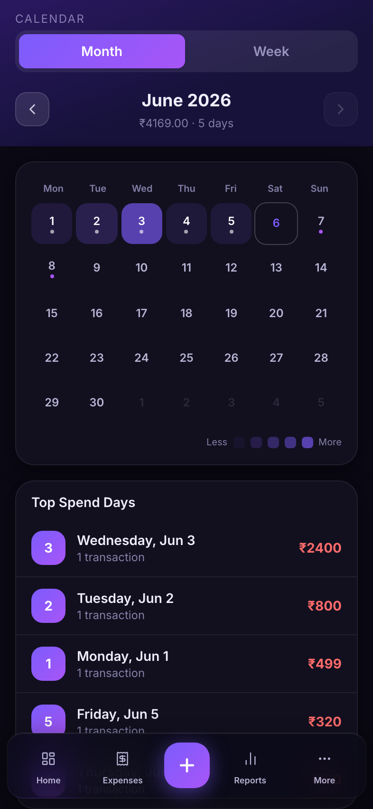

<p align="center">
  
</p>

<h1 align="center">SR Expense — SpendWise</h1>

<p align="center">
  <strong>Offline-first personal finance tracker — private, powerful, mobile-ready.</strong><br/>
  Built by <strong>SR</strong> &nbsp;·&nbsp; No backend &nbsp;·&nbsp; No sign-up &nbsp;·&nbsp; Your data stays on your device.
</p>

<p align="center">
  
  
  
  
  
</p>

---

## App Tour

<p align="center">
  
</p>

---

## Screenshots

<table>
  <tr>
    <td align="center"><br/><sub><b>Dashboard</b></sub></td>
    <td align="center"><br/><sub><b>Spending Trends</b></sub></td>
    <td align="center"><br/><sub><b>Expense List</b></sub></td>
  </tr>
  <tr>
    <td align="center"><br/><sub><b>Reports & Analytics</b></sub></td>
    <td align="center"><br/><sub><b>Calendar View</b></sub></td>
    <td align="center"><br/><sub><b>Tasks & Checklists</b></sub></td>
  </tr>
  <tr>
    <td align="center"><br/><sub><b>Subscriptions</b></sub></td>
    <td align="center"><br/><sub><b>Settings</b></sub></td>
    <td align="center"><br/><sub><b>Add Expense</b></sub></td>
  </tr>
</table>

---

## Features

| Feature               | Description                                                                                  |
| --------------------- | -------------------------------------------------------------------------------------------- |
| **Dashboard**         | Net balance, income/expense summaries, donut chart, spending trend (6 months), budget ring   |
| **Expenses**          | Full CRUD with search, filters by category/payment method, month navigation, swipe-to-delete |
| **Categories**        | 15 built-in categories with emoji icons, custom category support                             |
| **Reports**           | Monthly/quarterly/yearly analytics, insights, charts, XLSX & CSV export                     |
| **Calendar**          | Visual calendar view showing daily spending with heat indicators                             |
| **Groups**            | Split expenses with friends — add members, track balances, settle up, Google Drive sync      |
| **Budgets**           | Monthly budget tracking with visual progress bars and 80%/100% alerts                       |
| **Subscriptions**     | Recurring expense tracker — upcoming renewals, monthly commitment total                      |
| **Tasks / SpendPlan** | To-do tasks and shopping checklists with estimated costs, convert-to-expense                 |
| **Quick Add**         | Full-screen NumPad page — bookmark as home screen shortcut for instant entry                 |
| **Google Drive Sync** | OAuth backup/restore to your own Google Drive — no app server ever sees your data           |
| **Settings**          | 7 themes (Dark/Light/AMOLED/Midnight/Forest/Rose/System), 8 accent colours, 10 currencies   |
| **Trip Mode**         | Switch to a travel currency with one tap — auto-reverts when you're back                     |
| **PWA**               | Install as native app on iOS & Android — works fully offline, App Badging API                |
| **Offline-first**     | All data stored in IndexedDB (Dexie.js) — no server needed, ever                            |
| **Notifications**     | Budget alerts and overdue task reminders via Web Push                                        |
| **Haptics**           | Native haptic feedback on mobile                                                             |
| **Onboarding**        | First-run wizard: pick currency, set budget, done                                            |

## Tech Stack

| Layer          | Technology                |
| -------------- | ------------------------- |
| **Framework**  | React 19 + TypeScript 6.0 |
| **Build**      | Vite 8                    |
| **Styling**    | Tailwind CSS 4            |
| **State**      | Zustand 5                 |
| **Database**   | Dexie.js (IndexedDB)      |
| **Charts**     | Recharts 3                |
| **Icons**      | Lucide React              |
| **Routing**    | React Router 7            |
| **Animations** | Framer Motion             |
| **Search**     | Fuse.js                   |
| **PWA**        | vite-plugin-pwa (Workbox) |
| **Date utils** | date-fns                  |

## Project Structure

```
expense-manager/
├── public/                     # Static assets & PWA icons
├── src/
│   ├── components/
│   │   ├── layout/             # AppLayout, BottomNav, PageHeader
│   │   └── ui/                 # Button, Card, Modal, Input, Toast, NumPad, OnboardingWizard, etc.
│   ├── core/
│   │   ├── constants.ts        # Default categories, currencies, settings
│   │   ├── types.ts            # TypeScript interfaces
│   │   ├── utils.ts            # Currency formatting, date helpers
│   │   ├── haptics.ts          # Native haptic feedback
│   │   └── smsParser.ts        # SMS transaction parser
│   ├── db/
│   │   ├── schema.ts           # Dexie DB schema, seed defaults
│   │   └── queries.ts          # Database query functions
│   ├── features/
│   │   ├── dashboard/          # Home page with summary widgets
│   │   ├── expenses/           # Expense list, form, item components
│   │   ├── reports/            # Analytics & charts
│   │   ├── calendar/           # Calendar view
│   │   ├── groups/             # Group expense splitting
│   │   ├── tasks/              # SpendPlan — to-dos & checklists
│   │   ├── subscriptions/      # Recurring expense tracker
│   │   ├── quick-add/          # Standalone NumPad entry page
│   │   ├── share/              # PWA share target handler
│   │   └── settings/           # App settings
│   ├── hooks/
│   │   └── usePwaInstall.ts    # PWA install prompt hook
│   ├── services/
│   │   ├── googleSync.ts       # Google Drive OAuth backup/restore
│   │   ├── exportXlsx.ts       # Excel export
│   │   ├── notifications.ts    # Web Push notifications
│   │   └── recurringProcessor.ts # Auto-process recurring expenses
│   ├── store/                  # Zustand stores (expenses, categories, budgets, groups, settings, tasks, sync)
│   ├── App.tsx                 # Root component with routing
│   ├── main.tsx                # Entry point
│   └── index.css               # Global styles, theme variables
├── index.html
├── vite.config.ts
├── tsconfig.json
└── package.json
```

## Prerequisites

- **Node.js** >= 18
- **npm** >= 9 (or pnpm / yarn)

## Getting Started

```bash
# Clone the repo
git clone https://github.com/sharukrmys/spendwise.git
cd spendwise

# Install dependencies
npm install

# Start dev server
npm run dev
```

The app will be available at **http://localhost:5173**

### Available Scripts

| Command           | Description                       |
| ----------------- | --------------------------------- |
| `npm run dev`     | Start development server with HMR |
| `npm run build`   | Type-check + production build     |
| `npm run preview` | Preview production build locally  |
| `npm run lint`    | Run ESLint                        |

### Environment Variables (optional)

Create `.env.local` to enable Google Drive sync:

```bash
VITE_GOOGLE_CLIENT_ID=your_google_oauth_client_id
```

See `.env.example` for the full list of available variables.

## Deployment

### Option 1: Vercel (Recommended)

```bash
# Install Vercel CLI globally
npm i -g vercel

# Link and deploy (one-time setup)
cd expense-manager
vercel link

# Preview deploy
vercel

# Production deploy
vercel --prod
```

Or import your repo at [vercel.com](https://vercel.com) for automatic deploys on every push.

**Free tier:** Unlimited bandwidth for personal projects, HTTPS, custom domains.

### Option 2: Netlify

```bash
npm run build
npx netlify-cli deploy --prod --dir=dist
```

Or connect your GitHub repo at [netlify.com](https://netlify.com) for automatic deploys on push.

### Option 3: Cloudflare Pages

```bash
npm run build
npx wrangler pages deploy dist --project-name=sr-expense
```

### Option 4: GitHub Pages

1. Push to GitHub
2. Go to **Settings → Pages → Source: GitHub Actions**
3. Add this workflow as `.github/workflows/deploy.yml`:

```yaml
name: Deploy to GitHub Pages
on:
  push:
    branches: [main]
jobs:
  deploy:
    runs-on: ubuntu-latest
    permissions:
      pages: write
      id-token: write
    environment:
      name: github-pages
      url: ${{ steps.deployment.outputs.page_url }}
    steps:
      - uses: actions/checkout@v4
      - uses: actions/setup-node@v4
        with:
          node-version: 20
      - run: npm ci && npm run build
        working-directory: expense-manager
      - uses: actions/upload-pages-artifact@v3
        with:
          path: expense-manager/dist
      - id: deployment
        uses: actions/deploy-pages@v4
```

> **Note:** For GitHub Pages, set `base: '/<repo-name>/'` in `vite.config.ts` if not deploying to a custom domain.

### Option 5: AWS S3 + CloudFront

```bash
npm run build
aws s3 sync dist/ s3://your-bucket-name --delete
aws cloudfront create-invalidation --distribution-id YOUR_DIST_ID --paths "/*"
```

Enable **Static Website Hosting** on the S3 bucket and set both index and error document to `index.html`.

## Install as Mobile App (PWA)

Once deployed to any HTTPS URL:

### iOS (Safari)

1. Open the app URL in Safari
2. Tap the **Share** button (↑)
3. Tap **"Add to Home Screen"**
4. Tap **Add**

### Android (Chrome)

1. Open the app URL in Chrome
2. Tap the **⋮** menu
3. Tap **"Install app"** or **"Add to Home Screen"**

The app will appear on your home screen as a native app — full screen, no browser bar, works offline.

### Quick Add Shortcut

Bookmark `/quick-add` as a separate home screen shortcut for instant, numpad-first expense entry without opening the full app.

## Configuration

### Default Currency

Edit `src/core/constants.ts` → `DEFAULT_SETTINGS.defaultCurrency` (default: `INR`).

Available: USD, EUR, GBP, INR, JPY, CAD, AUD, CHF, SGD, AED.

### Theme

7 built-in themes: **Dark**, **Light**, **AMOLED**, **Midnight Blue**, **Forest**, **Rose Gold**, **System**. Change in Settings or edit `DEFAULT_SETTINGS.theme`.

### Accent Colour

8 accent colours: Violet, Blue, Cyan, Green, Rose, Orange, Pink, Gold. Customisable per-session in Settings.

### Categories

15 built-in categories. Add custom ones via Settings → Categories. Stored locally in IndexedDB.

## Google Drive Sync

1. Create a Google Cloud project and enable the Drive API
2. Create an OAuth 2.0 client ID (Web application type)
3. Add your app URL to **Authorised JavaScript origins**
4. Set `VITE_GOOGLE_CLIENT_ID` in `.env.local`
5. Connect via Settings → Cloud Sync → Connect Google Drive

Your data is backed up to a private **App Data Folder** in your own Drive (invisible in Drive UI). Groups use regular Drive files for sharing.

## Data & Privacy

- **Zero backend** — all data is stored in your browser's IndexedDB
- **No accounts** — no sign-up, no login
- **No tracking** — no analytics, no telemetry
- **Offline-first** — works without internet after first load
- **Your data, your device** — nothing leaves the browser unless you explicitly connect Google Drive
- **Google Drive sync** — goes exclusively to **your** Drive, never to an app server

> **Backup:** Use Settings → Export to download a JSON backup. Import it on any device to restore.

## License

MIT

---

<p align="center">
  Built with ❤️ by <strong>SR</strong>
</p>
